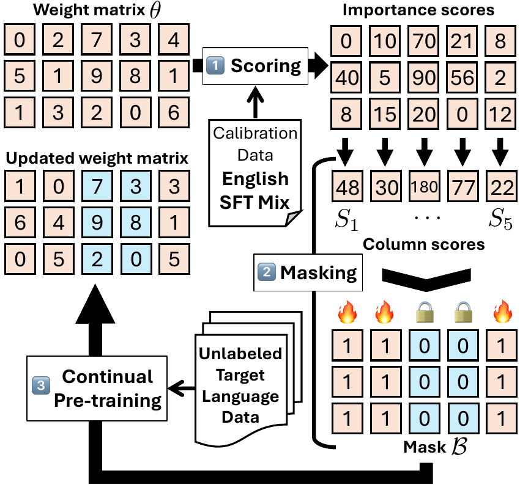

Mitigating Catastrophic Forgetting in Target Language Adaptation of LLMs via Source-Shielded Updates
===

This is the official repository for the ACL 2026 paper "Mitigating Catastrophic Forgetting in Target Language Adaptation of LLMs via Source-Shielded Updates". We provide code and step-by-step instructions for reproducing our experiments.

<div style="text-align: center;">
    
</div>

> [!Note] Throughout the repository, you will find the following placeholders:
>
> * `your-hf-id`: Your Hugging Face ID to create and push datasets.
> * `/path/to/containers/`: A directory to store downloaded container images.
> * `/path/to/cache/`: A directory to store cache files.
> * `/path/to/envs/`: A directory to create virtual environments.
> * `/path/to/processed/data`: A directory to store processed data.
> * `/path/to/models/`: A directory to store model checkpoints.
> * `/path/to/logs/`: A directory to store logs for training.
> * `/path/to/mnt`: A directory to bind-mount your data directory if needed.
> * `your_openai_api_key`: Your OpenAI API key.
>
> Please replace these placeholders with the actual paths relevant to your environment.
>
> Also, please make sure to log in to the Hugging Face Hub using `huggingface-cli login` before running any scripts that require access to the Hugging Face Hub.
>
> We do not expect you to modify any code other than the placeholders to reproduce our results.


## Installation
We recommend using a pre-built Docker image for easy setup. We use the official ROCm+PyTorch image for AMD GPUs and the `apptainer` tool for container management. To avoid compatibility issues, we create four different environments.

### For preprocessing and training
```bash
# Download the container
mkdir -p /path/to/containers/
APPTAINER_CACHEDIR=/path/to/containers/
export APPTAINER_CACHEDIR
apptainer pull --dir $APPTAINER_CACHEDIR docker://rocm/pytorch:rocm6.4.1_ubuntu24.04_py3.12_pytorch_release_2.6.0

# Enable the ROCm environment
apptainer exec --fakeroot --bind /path/to/mnt:/path/to/mnt --rocm $APPTAINER_CACHEDIR/pytorch_rocm6.4.1_ubuntu24.04_py3.12_pytorch_release_2.6.0.sif /bin/bash

# Set configurations
export TRANSFORMERS_VERBOSITY=debug
export HF_HOME="/path/to/cache/"
export HF_HUB_CACHE="/path/to/cache/"
export HF_DATASETS_CACHE="/path/to/cache/"
export HF_DATASETS_TRUST_REMOTE_CODE=true

# Create an env
python3 -m venv --system-site-packages /path/to/envs/ssu_train
source /path/to/envs/ssu_train/bin/activate

# Install packages
pip install transformers==4.52.4 peft==0.15.2 datasets==3.6.0 evaluate scikit-learn sentencepiece==0.2.0 huggingface-hub tqdm pyarrow protobuf tiktoken==0.9.0 nltk==3.9.1 zstandard
mkdir -p ~/src
cd ~/src
git clone --depth 1 https://github.com/ROCm/flash-attention.git
cd flash-attention
MAX_JOBS=$((`nproc` - 1)) pip install -v . --no-build-isolation

# Clone our repository
cd ~/src
git clone https://github.com/gucci-j/ssu.git # or just download the zip file and unzip it
```

### For evaluation with LightEval and AlapacaEval 2.0
```bash
# Enable the ROCm environment
apptainer exec --fakeroot --bind /path/to/mnt:/path/to/mnt --rocm $APPTAINER_CACHEDIR/pytorch_rocm6.4.1_ubuntu24.04_py3.12_pytorch_release_2.6.0.sif /bin/bash

# Set configurations
export TRANSFORMERS_VERBOSITY=debug
export HF_HOME="/path/to/cache/"
export HF_HUB_CACHE="/path/to/cache/"
export HF_DATASETS_CACHE="/path/to/cache/"
export HF_DATASETS_TRUST_REMOTE_CODE=true

# Create an env
python3 -m venv --system-site-packages /path/to/envs/ssu_lighteval
source /path/to/envs/ssu_lighteval/bin/activate

# Install packages
pip install transformers==4.52.4 peft==0.15.2 datasets==3.6.0 evaluate scikit-learn sentencepiece==0.2.0 huggingface-hub tqdm pyarrow protobuf tiktoken==0.9.0 nltk==3.9.1 zstandard langcodes

# Get LightEval
cd ~/src
git clone https://github.com/huggingface/lighteval
cd lighteval
git checkout 327071fe86e427d880f907a51d1462f4a3f951c1

# Apply some patches by copying the contents of the patches directory
cd ~/src/ssu/evaluation/src/patches
cp __init__.py ~/src/lighteval/src/lighteval/metrics/
cp adapter_model.py ~/src/lighteval/src/lighteval/models/transformers/
cp language.py ~/src/lighteval/src/lighteval/utils/
cp model_input.py ~/src/lighteval/src/lighteval/models/
cp prompt_manager.py ~/src/lighteval/src/lighteval/tasks/
cp requests.py ~/src/lighteval/src/lighteval/tasks/
cp transformers_model.py ~/src/lighteval/src/lighteval/models/transformers/
cp translation_literals.py ~/src/lighteval/src/lighteval/tasks/templates/utils/

# Install LightEval and AlpacaEval 2.0
cd ~/src/lighteval
pip install .
pip install alpaca-eval==0.6.6
```

<details>
<summary> For NVIDIA GPUs </summary>

We optionally use NVIDIA GPUs for evaluation. The following commands set up the environment for using NVIDIA GPUs.

```bash
mkdir -p /path/to/containers/
APPTAINER_CACHEDIR=/path/to/containers/
export APPTAINER_CACHEDIR
apptainer pull --dir $APPTAINER_CACHEDIR docker://nvcr.io/nvidia/pytorch:25.04-py3

apptainer exec \
    --bind /path/to/mnt:/path/to/mnt \
    --fakeroot \
    --nv $APPTAINER_CACHEDIR/pytorch_25.04-py3.sif \
    /bin/bash

python3 -m venv --system-site-packages /path/to/envs/ssu_lighteval
source /path/to/envs/ssu_lighteval/bin/activate

# Install packages
unset PIP_CONSTRAINT
pip install transformers==4.52.4 peft==0.15.2 datasets==3.6.0 evaluate scikit-learn sentencepiece==0.2.0 huggingface-hub tqdm pyarrow protobuf tiktoken==0.9.0 nltk==3.9.1 zstandard langcodes

# Clone our repository
mkdir -p ~/src
cd ~/src
git clone https://github.com/gucci-j/ssu.git # or just download the zip file and unzip it

# Get LightEval
git clone https://github.com/huggingface/lighteval
cd lighteval
git checkout 327071fe86e427d880f907a51d1462f4a3f951c1

# Apply some patches by copying the contents of the patches directory
cd ~/src/ssu/evaluation/src/patches
cp __init__.py ~/src/lighteval/src/lighteval/metrics/
cp adapter_model.py ~/src/lighteval/src/lighteval/models/transformers/
cp language.py ~/src/lighteval/src/lighteval/utils/
cp model_input.py ~/src/lighteval/src/lighteval/models/
cp prompt_manager.py ~/src/lighteval/src/lighteval/tasks/
cp requests.py ~/src/lighteval/src/lighteval/tasks/
cp transformers_model.py ~/src/lighteval/src/lighteval/models/transformers/
cp translation_literals.py ~/src/lighteval/src/lighteval/tasks/templates/utils/

# Install LightEval and AlpacaEval 2.0
cd ~/src/lighteval
pip install .
pip install alpaca-eval==0.6.6
```
</details>

After installation, you need to copy the evaluation config file for AlpacaEval 2.0 from [./evaluation/config/alpaca_eval_gpt4.1-nano.yml](./evaluation/config/alpaca_eval_gpt4.1-nano.yml) in this repository to the `/your/env/path/to/site-packages/alpaca_eval/evaluators_configs/` directory.


### For evaluation with lm-evaluation-harness
```bash
# Enable the ROCm environment
apptainer exec --fakeroot --bind /path/to/mnt:/path/to/mnt --rocm $APPTAINER_CACHEDIR/pytorch_rocm6.4.1_ubuntu24.04_py3.12_pytorch_release_2.6.0.sif /bin/bash

# Set configurations
export TRANSFORMERS_VERBOSITY=debug
export HF_HOME="/path/to/cache"
export HF_HUB_CACHE="/path/to/cache"
export HF_DATASETS_CACHE="/path/to/cache"
export HF_DATASETS_TRUST_REMOTE_CODE=true

# Create an env
python3 -m venv --system-site-packages /path/to/envs/ssu_lmeval
source /path/to/envs/ssu_lmeval/bin/activate

# Install packages
pip install transformers==4.52.4 peft==0.15.2 datasets==3.6.0 evaluate scikit-learn sentencepiece==0.2.0 huggingface-hub tqdm pyarrow protobuf tiktoken==0.9.0 nltk==3.9.1 zstandard
cd ~/src
git clone --depth 1 --branch v0.4.8 https://github.com/EleutherAI/lm-evaluation-harness.git
cd lm-evaluation-harness
pip install ".[math,ifeval,sentencepiece]"
```

<details>
<summary> For NVIDIA GPUs </summary>

```bash
apptainer exec \
    --bind /path/to/mnt:/path/to/mnt \
    --fakeroot \
    --nv $APPTAINER_CACHEDIR/pytorch_25.04-py3.sif \
    /bin/bash

python3 -m venv --system-site-packages /path/to/envs/ssu_lmeval
source /path/to/envs/ssu_lmeval/bin/activate

# Install packages
unset PIP_CONSTRAINT
pip install transformers==4.52.4 peft==0.15.2 datasets==3.6.0 evaluate scikit-learn sentencepiece==0.2.0 huggingface-hub tqdm pyarrow protobuf tiktoken==0.9.0 nltk==3.9.1 zstandard
cd ~/src/
git clone --depth 1 --branch v0.4.8 https://github.com/EleutherAI/lm-evaluation-harness.git
cd lm-evaluation-harness
pip install ".[math,ifeval,sentencepiece]"
```

</details>


### For safety evaluation
```bash
#!/bin/bash

# Download the container
mkdir -p /path/to/containers/
APPTAINER_CACHEDIR=/path/to/containers/
export APPTAINER_CACHEDIR
apptainer pull --dir $APPTAINER_CACHEDIR docker://rocm/vllm:rocm6.4.1_vllm_0.9.1_20250702

# Enable the ROCm environment
apptainer exec --fakeroot --bind /path/to/mnt:/path/to/mnt --rocm $APPTAINER_CACHEDIR/vllm_rocm6.4.1_vllm_0.9.1_20250702.sif /bin/bash

# Create a virtual environment
python3 -m venv --system-site-packages /path/to/envs/ssu_vllm
source /path/to/envs/ssu_vllm/bin/activate

# Set configurations
export TRANSFORMERS_VERBOSITY=debug
export HF_HOME="/path/to/cache/"
export HF_HUB_CACHE="/path/to/cache/"
export HF_DATASETS_CACHE="/path/to/cache/"
export HF_DATASETS_TRUST_REMOTE_CODE=true

# Install packages
cd ~/src
git clone https://github.com/nouhadziri/safety-eval-fork.git
cd safety-eval-fork
git checkout 2920bb85a8a8390144b9256f697395f81b94822e
pip install -e .
pip install fire>=0.7.1 tenacity>=9.1.2 fastchat>=0.1.0 scikit-learn>=1.7.1
```

After installation, you need to obtain access to the following Hugging Face Hub repositories for evaluation:  
* [allenai/wildguard](https://huggingface.co/allenai/wildguard)
* [allenai/wildguardmix](https://huggingface.co/datasets/allenai/wildguardmix)
* [allenai/xstest-response](https://huggingface.co/datasets/allenai/xstest-response)
* [allenai/wildjailbreak](https://huggingface.co/datasets/allenai/wildjailbreak)

Note that we did not use NVIDIA GPUs for safety alignment evaluation. Therefore, we cannot provide the corresponding step-by-step instructions.


## Preprocessing

### Training data
To preprocess training data, you can use the [`generate_cpt_data.py`](./preprocessing/src/generate_cpt_data.py) script. The following example demonstrates how to run the script for a specific model and language code:

<details>
<summary> Click here to expand </summary>

```bash
#!/bin/bash

source /path/to/envs/ssu_train/bin/activate

export TRANSFORMERS_VERBOSITY=debug
export HF_HOME="/path/to/cache/"
export HF_HUB_CACHE="/path/to/cache/"
export HF_DATASETS_CACHE="/path/to/cache/"
export HF_DATASETS_TRUST_REMOTE_CODE=true

model_name=$1
lang_code=$2
if [ -z "$model_name" ] || [ -z "$lang_code" ]; then
    echo "Usage: $0 <model_name> <lang_code>"
    echo "Example: $0 allenai/OLMo-2-1124-7B-Instruct amh_Ethi"
    exit 1
fi
if [ "$lang_code" == "amh_Ethi" ]; then
    short_lang_code="am"
elif [ "$lang_code" == "hau_Latn" ]; then
    short_lang_code="ha"
elif [ "$lang_code" == "ibo_Latn" ]; then
    short_lang_code="ig"
elif [ "$lang_code" == "npi_Deva" ]; then
    short_lang_code="ne"
elif [ "$lang_code" == "kir_Cyrl" ]; then
    short_lang_code="ky"
else
    echo "Unsupported language code: $lang_code"
    exit 1
fi
if [ "$model_name" == "allenai/OLMo-2-1124-7B-Instruct" ]; then
    model_abbrev="OLMo-2-1124-7B-Instruct"
else
    echo "Unsupported model name: $model_name"
    exit 1
fi

cd ~/src/ssu/preprocessing/src
python generate_cpt_data.py \
    --lang_code $short_lang_code \
    --output_dir "/path/to/processed/data/${model_abbrev}_${short_lang_code}" \
    --cache_dir "/path/to/cache/" \
    --tokenizer_name_or_path "${model_name}" \
    --num_workers 31 \
    --max_length 512
```

</details>


### Calibration data
To generate the calibration data, you can use the [`generate_calibration_data.py`](./preprocessing/src/generate_calibration_data.py) script. This script will create a calibration dataset based on the specified model. The following example demonstrates how to run the script for a specific model:

<details>
<summary> Click here to expand </summary>

```bash
#!/bin/bash

source /path/to/envs/ssu_train/bin/activate

export TRANSFORMERS_VERBOSITY=debug
export HF_HOME="/path/to/cache/"
export HF_HUB_CACHE="/path/to/cache/"
export HF_DATASETS_CACHE="/path/to/cache/"
export HF_DATASETS_TRUST_REMOTE_CODE=true

model_name=$1
if [ -z "$model_name" ]; then
    echo "Usage: $0 <model_name>"
    echo "Example: $0 allenai/OLMo-2-1124-7B-Instruct"
    exit 1
fi
if [ "$model_name" == "allenai/OLMo-2-1124-7B-Instruct" ]; then
    model_abbrev="OLMo-2-1124-7B-Instruct"
else
    echo "Unsupported model name: $model_name"
    exit 1
fi

cd ~/src/ssu/preprocessing/src
python generate_calibration_data.py \
    --output_dir "/path/to/processed/data/${model_abbrev}_calib" \
    --cache_dir "/path/to/cache/" \
    --dataset_name allenai/tulu-3-sft-olmo-2-mixture \
    --split train \
    --num_samples 2000 \
    --tokenizer_name_or_path "${model_name}" \
    --num_workers 8 \
    --block_size 2048 \
    --shuffle \
    --streaming

```

Note that `num_samples` specifies the number of **raw** samples to construct calibration data. This is not the same as the number of processed samples that will be used for the actual calibration. Also, it does not always necessarily need 2000 samples for constructing 500 calibration samples. We can tailor this number based on the specific requirements of the calibration process.

</details>

For the ablation analysis of using the Alpaca data, you can refer to [`generate_calibration_data_alpaca.sh`](./preprocessing/scripts/generate_calibration_data_alpaca.sh). Basically, just change `dataset_name` to `tatsu-lab/alpaca`.


### Evaluation data
To generate summarization and machine translation evaluation data, you can use the [`generate_sum_data.py`](./preprocessing/src/generate_sum_data.py) and [`generate_mt_data.py`](./preprocessing/src/generate_mt_data.py) scripts, respectively. The rest of the evaluation tasks do not need preprocessing. The following example demonstrates how to run each script:

<details>
<summary>Click here to expand</summary>

```bash
#!/bin/bash

source /path/to/envs/ssu_train/bin/activate

export TRANSFORMERS_VERBOSITY=debug
export HF_HOME="/path/to/cache/"
export HF_HUB_CACHE="/path/to/cache/"
export HF_DATASETS_CACHE="/path/to/cache/"
export HF_DATASETS_TRUST_REMOTE_CODE=true

cd ~/src/ssu/preprocessing/src
mkdir -p /path/to/outputs/

# Generate MT data
python generate_mt_data.py \
    --output_dir "/path/to/outputs" \
    --cache_dir "/path/to/cache/" \
    --repo_id your-hf-id/flores-ssu

# Generate SUM data
lang_codes=(
    "ig"
    "ha"
    "ky"
    "ne"
    "am"
    "en"
)
for lang_code in "${lang_codes[@]}"; do
    python generate_sum_data.py \
        --output_dir "/path/to/outputs/" \
        --cache_dir "/path/to/cache/" \
        --repo_id your-hf-id/sum-${lang_code}-ssu \
        --lang_code ${lang_code} \
        --tokenizer_name_or_path "allenai/OLMo-2-1124-7B-Instruct"
done

```

</details>


## Continual pre-training
To train the model using the tokenized data, you can use the [`main.py`](./training/src/main.py) script. This script will handle the training process, including loading the data, setting up the model, and running the training loop.

### Supported training strategies
* **Full fine-tuning** (FFT): Fine-tune all parameters in the model.

* **Half fine-tuning** (HFT): A state-of-the-art **static** selective parameter update approach that updates exactly 50\% of parameters using a fine-grained, per-layer strategy. Its freezing strategy is as follows: (1) for self-attention, it randomly freezes two of the four matrices ($W_Q, W_K, W_V, W_O$); (2) for feed-forward layers, it freezes two of three matrices ($W_{up}, W_{down}, W_{gate}$) in a random half of the layers and one matrix in the remaining half. This is based on [https://aclanthology.org/2025.acl-long.626/](https://aclanthology.org/2025.acl-long.626/).

* **Gradient-Mask Tuning** (GMT): A state-of-the-art **dynamic** selective parameter update approach that drops gradients of a pre-defined ratio (50% in this study for fair comparison with HFT and SSU) with smaller absolute values on the target data. This is based on [https://ojs.aaai.org/index.php/AAAI/article/view/34621](https://ojs.aaai.org/index.php/AAAI/article/view/34621).

* **Lottery Ticket Adaptation: Mitigating Destructive Interference in LLMs** (LoTA): A static selective parameter update approach that calibrates mask then sparsely fine-tunes only selected weights. This is based on [https://arxiv.org/abs/2406.16797](https://arxiv.org/abs/2406.16797).

* **S2FT: Efficient, Scalable and Generalizable LLM Fine-tuning by Structured Sparsity** (S2FT): A static selective parameter update approach that selects FFN channels, permutes coupled weights, and fine-tunes only the connected submatrices. This is based on [https://arxiv.org/abs/2412.06289](https://arxiv.org/abs/2412.06289).

* **AdaLoRA**: An architecture-based method to mitigate catastrophic forgetting for reference. This achieves the best overall performance across different LoRA-like approaches in the HFT paper.

* **SSU-Rand** (Random): Freezes an equal number of randomly-selected columns to verify that the importance-based selection in SSU is meaningful.

* **SSU-Mag** (Magnitude): Freezes columns based only on the magnitude score (i.e., $|\theta_{ij}|$), isolating the effect of the activation term.

* **SSU-Wanda**: The primary proposed method that implements SSU in the paper. Freezes columns based on the Wanda score.

* **SSU-SparseGPT** (SparseGPT): An alternative version of SSU that uses SparseGPT for computing importance scores. This is used only for ablation analysis.

* **SSU-Fisher** (Fisher): An alternative version of SSU that uses the Fisher information matrix for computing importance scores. This is used only for ablation analysis.


### Example job scripts
Here are example job scripts for each training strategy.

#### OLMo-2-7B-1124-Instruct

| Strategy | Script |
|----------|--------|
| FFT | [fft.sh](./training/scripts/fft.sh) |
| AdaLoRA | [adalora.sh](./training/scripts/adalora.sh) |
| HFT | [hft.sh](./training/scripts/hft.sh) |
| GMT | [gmt.sh](./training/scripts/gmt.sh) |
| SSU-Rand | [random.sh](./training/scripts/random.sh) |
| SSU-Mag | [magnitude.sh](./training/scripts/magnitude.sh) |
| SSU-Wanda | [ssu.sh](./training/scripts/ssu.sh) |

##### For ablation analysis
| Category | Variant | Script | Notes |
|----------|---------|--------|-------|
| SSU | Freezing ratio | [ssu_ratio.sh](./training/scripts/ssu_ratio.sh) | |
| Baseline freezing ratio | HFT | [hft_ratio.sh](./training/scripts/hft_ratio.sh) | |
| Baseline freezing ratio | GMT | [gmt_ratio.sh](./training/scripts/gmt_ratio.sh) | |
| SSU freezing method | Row-wise | [ssu_rw.sh](./training/scripts/ssu_rw.sh) | |
| SSU freezing method | Element-wise | [ssu_ew.sh](./training/scripts/ssu_ew.sh) | |
| SSU calibration data | Alpaca | [ssu_alpaca.sh](./training/scripts/ssu_alpaca.sh) | |
| SSU calibration data size | 128 samples | [ssu_128.sh](./training/scripts/ssu_128.sh) | |
| SSU importance scoring | SparseGPT | [ssu_sgpt.sh](./training/scripts/ssu_sgpt.sh) | |
| SSU importance scoring | Fisher | [ssu_fisher.sh](./training/scripts/ssu_fisher.sh) | |
| Additional baseline | LoTA (90\% sparsity) | [lota.sh](./training/scripts/lota.sh) | |
| Additional baseline | LoTA (50\% sparsity) | [lota_ratio.sh](./training/scripts/lota_ratio.sh) | Provide 0.5 as the second argument. |
| Additional baseline | LoTA (sparsity ablation; Appendix) | [lota_ratio.sh](./training/scripts/lota_ratio.sh) | Provide the desired sparsity as the second argument. |
| Additional baseline | S2FT (Down) | [s2ft_down.sh](./training/scripts/s2ft_down.sh) | |
| Additional baseline | S2FT (Down & Output; Appendix) | [s2ft_down_output.sh](./training/scripts/s2ft_down_output.sh) | |
| Additional baseline | S2FT (sparsity ablation, rank = 16; Appendix) | [s2ft_down_16.sh](./training/scripts/s2ft_down_16.sh) | |
| Additional baseline | S2FT (sparsity ablation, rank = 32; Appendix) | [s2ft_down_32.sh](./training/scripts/s2ft_down_32.sh) | |
| Additional baseline | S2FT (sparsity ablation, rank = 64; Appendix) | [s2ft_down_64.sh](./training/scripts/s2ft_down_64.sh) | |


#### OLMo-2-13B-1124-Instruct
| Strategy | Script |
|----------|--------|
| FFT | [fft_13b.sh](./training/scripts/fft_13b.sh) |
| AdaLoRA | [adalora_13b.sh](./training/scripts/adalora_13b.sh) |
| HFT | [hft_13b.sh](./training/scripts/hft_13b.sh) |
| GMT | [gmt_13b.sh](./training/scripts/gmt_13b.sh) |
| SSU-Rand | [random_13b.sh](./training/scripts/random_13b.sh) |
| SSU-Mag | [magnitude_13b.sh](./training/scripts/magnitude_13b.sh) |
| SSU-Wanda | [ssu_13b.sh](./training/scripts/ssu_13b.sh) |


### On converting S2FT permuted checkpoints
To convert S2FT permuted checkpoints back to the original weight format for evaluation, you can use the [`convert_s2_to_linear.py`](./training/src/convert_s2_to_linear.py) script. Here is an example of how to run the script:

<details>
<summary> Click here to expand </summary>

```bash
#!/bin/bash

source /path/to/envs/ssu_train/bin/activate

# Configs
export TRANSFORMERS_VERBOSITY=debug
export HF_HOME="/path/to/cache"
export HF_HUB_CACHE="/path/to/cache"
export HF_DATASETS_CACHE="/path/to/cache"
export HF_DATASETS_TRUST_REMOTE_CODE=true
model_abbrev="OLMo-2-1124-7B-Instruct"
lang_code="$1"
approach="$2"
output_dir="/path/to/models/${model_abbrev}-${lang_code}-${approach}/checkpoint-12208"
model_name_or_path="allenai/OLMo-2-1124-7B-Instruct"

cd ~/src/ssu/training/src
python utils/convert_s2_to_linear.py \
    --input "${output_dir}" \
    --output "${output_dir}_converted/" \
    --dtype bf16 \
    --reconstruct-s2 \
    --selections ~/src/ssu/training/src/${approach}.json
```
</details>

For ``selections``, please provide the corresponding selection results, which can be found in a training log file (i.e., the second output of `s2ft_enable()` function calls) and save it as a JSON file under the `training/src/` directory. The file name should match the `approach` argument (e.g., `s2ft_down.json` for S2FT (Down)).


## Evaluation

We use various benchmarks to evaluate performance of each approach.

* **Chat and instruction-following benchmarks**: IFEval, AlpacaEval 2.0, MTBench, and GSM8K.
* **Safety benchmarks**: [Tulu 3 Safety Evaluation Suite](https://github.com/allenai/safety-eval). Note that the safety evaluation requires GPT-4 API access. See [https://github.com/allenai/open-instruct/issues/500](https://github.com/allenai/open-instruct/issues/500) for more details.
* **English benchmarks**: MMLU (Acc), Belebele (Acc), SUM (chrF++), MT (chrF)
* **Target language benchmarks**: Global MMLU (Acc), Belebele (Acc), SUM (chrF++), MT (chrF++)


### Example job scripts

Similar to the training scripts, we provide evaluation scripts for each model variant. Some evaluations like Safety and AE2 require access to OpenAI APIs.

#### Source model evaluation
* [For generation tasks](./evaluation/scripts/source_gen.sh)
* [For classification tasks](./evaluation/scripts/source_cls.sh)
* [For safety evaluation](./evaluation/scripts/source_safety.sh)
* [For AlpacaEval 2.0 scoring](./evaluation/scripts/source_ae2.sh)

#### 7B adapted model evaluation
* [For general evaluation (including both classification and generation) except for AdaLoRA](./evaluation/scripts/7b.sh)
* [For general evaluation of AdaLoRA](./evaluation/scripts/7b_adalora.sh)
* [For safety evaluation](./evaluation/scripts/7b_safety.sh)
* [For AlpacaEval 2.0 scoring](./evaluation/scripts/7b_ae2.sh)

You can also use the above same scripts for ablation analysis by specifying each variant name as an argument. (e.g., `bash ./evaluation/scripts/7b.sh ig ssu_alpaca 12208 1` to run the 7B evaluation with the Alpaca calibration data variant for SSU-Wanda. `12208` is the checkpoint steps. `1` here is to specify a postfix for logs to help distinguish between different runs. Also, when you specify `1`, the script will conduct both classification and generation evaluations. In contrast, if you specify `2` or `3`, it will only conduct generation evaluations to support multiple-run evaluation for generation tasks.)

#### 13B adapted model evaluation
* [For general evaluation (including both classification and generation) except for AdaLoRA](./evaluation/scripts/13b.sh)
* [For general evaluation of AdaLoRA](./evaluation/scripts/13b_adalora.sh)
* [For safety evaluation](./evaluation/scripts/13b_safety.sh)
* [For AlpacaEval 2.0 scoring](./evaluation/scripts/13b_ae2.sh)


## Analysis
We provide a script used for our qualitative analysis of linguistic code-mixing in the adapted models. You can find it at [`ae2_language_ratio_analyze.py`](./analysis/ae2_language_ratio_analyze.py).

To run the analysis, you can use the following script. Note that you need to install `fasttext`.
```bash
#!/bin/bash

# Create an env
python3 -m venv --system-site-packages /path/to/envs/ssu_analysis
source /path/to/envs/ssu_analysis/bin/activate

# Install packages
pip install fasttext pandas numpy==1.26.4 huggingface_hub

# Run the analysis
python ~/src/ssu/analysis/ae2_language_ratio_analyze.py
```

## Adapted Models
The adapted model checkpoints are available at the following Hugging Face Hub repositories:

| Approach | Model Size | Hugging Face Hub Repository |
|----------|------------|-----------------------------|
| FFT      | 7B         | [ne](https://huggingface.co/ssu-project/OLMo-2-1124-7B-Instruct-ne-fft) / [am](https://huggingface.co/ssu-project/OLMo-2-1124-7B-Instruct-am-fft) / [ig](https://huggingface.co/ssu-project/OLMo-2-1124-7B-Instruct-ig-fft) / [ha](https://huggingface.co/ssu-project/OLMo-2-1124-7B-Instruct-ha-fft) / [ky](https://huggingface.co/ssu-project/OLMo-2-1124-7B-Instruct-ky-fft) |
| FFT      | 13B        | [ne](https://huggingface.co/ssu-project/OLMo-2-1124-13B-Instruct-ne-fft) / [am](https://huggingface.co/ssu-project/OLMo-2-1124-13B-Instruct-am-fft) / [ig](https://huggingface.co/ssu-project/OLMo-2-1124-13B-Instruct-ig-fft) / [ha](https://huggingface.co/ssu-project/OLMo-2-1124-13B-Instruct-ha-fft) / [ky](https://huggingface.co/ssu-project/OLMo-2-1124-13B-Instruct-ky-fft) |
| HFT      | 7B         | [ne](https://huggingface.co/ssu-project/OLMo-2-1124-7B-Instruct-ne-hft) / [am](https://huggingface.co/ssu-project/OLMo-2-1124-7B-Instruct-am-hft) / [ig](https://huggingface.co/ssu-project/OLMo-2-1124-7B-Instruct-ig-hft) / [ha](https://huggingface.co/ssu-project/OLMo-2-1124-7B-Instruct-ha-hft) / [ky](https://huggingface.co/ssu-project/OLMo-2-1124-7B-Instruct-ky-hft) |
| HFT      | 13B        | [ne](https://huggingface.co/ssu-project/OLMo-2-1124-13B-Instruct-ne-hft) / [am](https://huggingface.co/ssu-project/OLMo-2-1124-13B-Instruct-am-hft) / [ig](https://huggingface.co/ssu-project/OLMo-2-1124-13B-Instruct-ig-hft) / [ha](https://huggingface.co/ssu-project/OLMo-2-1124-13B-Instruct-ha-hft) / [ky](https://huggingface.co/ssu-project/OLMo-2-1124-13B-Instruct-ky-hft) |
| GMT      | 7B         | [ne](https://huggingface.co/ssu-project/OLMo-2-1124-7B-Instruct-ne-gmt) / [am](https://huggingface.co/ssu-project/OLMo-2-1124-7B-Instruct-am-gmt) / [ig](https://huggingface.co/ssu-project/OLMo-2-1124-7B-Instruct-ig-gmt) / [ha](https://huggingface.co/ssu-project/OLMo-2-1124-7B-Instruct-ha-gmt) / [ky](https://huggingface.co/ssu-project/OLMo-2-1124-7B-Instruct-ky-gmt) |
| GMT      | 13B        | [ne](https://huggingface.co/ssu-project/OLMo-2-1124-13B-Instruct-ne-gmt) / [am](https://huggingface.co/ssu-project/OLMo-2-1124-13B-Instruct-am-gmt) / [ig](https://huggingface.co/ssu-project/OLMo-2-1124-13B-Instruct-ig-gmt) / [ha](https://huggingface.co/ssu-project/OLMo-2-1124-13B-Instruct-ha-gmt) / [ky](https://huggingface.co/ssu-project/OLMo-2-1124-13B-Instruct-ky-gmt) |
| SSU-Wanda | 7B       | [ne](https://huggingface.co/ssu-project/OLMo-2-1124-7B-Instruct-ne-ssu) / [am](https://huggingface.co/ssu-project/OLMo-2-1124-7B-Instruct-am-ssu) / [ig](https://huggingface.co/ssu-project/OLMo-2-1124-7B-Instruct-ig-ssu) / [ha](https://huggingface.co/ssu-project/OLMo-2-1124-7B-Instruct-ha-ssu) / [ky](https://huggingface.co/ssu-project/OLMo-2-1124-7B-Instruct-ky-ssu) |
| SSU-Wanda | 13B      | [ne](https://huggingface.co/ssu-project/OLMo-2-1124-13B-Instruct-ne-ssu) / [am](https://huggingface.co/ssu-project/OLMo-2-1124-13B-Instruct-am-ssu) / [ig](https://huggingface.co/ssu-project/OLMo-2-1124-13B-Instruct-ig-ssu) / [ha](https://huggingface.co/ssu-project/OLMo-2-1124-13B-Instruct-ha-ssu) / [ky](https://huggingface.co/ssu-project/OLMo-2-1124-13B-Instruct-ky-ssu) |
| AdaLoRA  | 7B         | [ne](https://huggingface.co/ssu-project/OLMo-2-1124-7B-Instruct-ne-adalora) / [am](https://huggingface.co/ssu-project/OLMo-2-1124-7B-Instruct-am-adalora) / [ig](https://huggingface.co/ssu-project/OLMo-2-1124-7B-Instruct-ig-adalora) / [ha](https://huggingface.co/ssu-project/OLMo-2-1124-7B-Instruct-ha-adalora) / [ky](https://huggingface.co/ssu-project/OLMo-2-1124-7B-Instruct-ky-adalora) |
| AdaLoRA  | 13B        | [ne](https://huggingface.co/ssu-project/OLMo-2-1124-13B-Instruct-ne-adalora) / [am](https://huggingface.co/ssu-project/OLMo-2-1124-13B-Instruct-am-adalora) / [ig](https://huggingface.co/ssu-project/OLMo-2-1124-13B-Instruct-ig-adalora) / [ha](https://huggingface.co/ssu-project/OLMo-2-1124-13B-Instruct-ha-adalora) / [ky](https://huggingface.co/ssu-project/OLMo-2-1124-13B-Instruct-ky-adalora) |
| SSU-Rand | 7B      | [ne](https://huggingface.co/ssu-project/OLMo-2-1124-7B-Instruct-ne-random) / [am](https://huggingface.co/ssu-project/OLMo-2-1124-7B-Instruct-am-random) / [ig](https://huggingface.co/ssu-project/OLMo-2-1124-7B-Instruct-ig-random) / [ha](https://huggingface.co/ssu-project/OLMo-2-1124-7B-Instruct-ha-random) / [ky](https://huggingface.co/ssu-project/OLMo-2-1124-7B-Instruct-ky-random) |
| SSU-Rand | 13B     | [ne](https://huggingface.co/ssu-project/OLMo-2-1124-13B-Instruct-ne-random) / [am](https://huggingface.co/ssu-project/OLMo-2-1124-13B-Instruct-am-random) / [ig](https://huggingface.co/ssu-project/OLMo-2-1124-13B-Instruct-ig-random) / [ha](https://huggingface.co/ssu-project/OLMo-2-1124-13B-Instruct-ha-random) / [ky](https://huggingface.co/ssu-project/OLMo-2-1124-13B-Instruct-ky-random) |
| SSU-Mag | 7B       | [ne](https://huggingface.co/ssu-project/OLMo-2-1124-7B-Instruct-ne-magnitude) / [am](https://huggingface.co/ssu-project/OLMo-2-1124-7B-Instruct-am-magnitude) / [ig](https://huggingface.co/ssu-project/OLMo-2-1124-7B-Instruct-ig-magnitude) / [ha](https://huggingface.co/ssu-project/OLMo-2-1124-7B-Instruct-ha-magnitude) / [ky](https://huggingface.co/ssu-project/OLMo-2-1124-7B-Instruct-ky-magnitude) |
| SSU-Mag | 13B      | [ne](https://huggingface.co/ssu-project/OLMo-2-1124-13B-Instruct-ne-magnitude) / [am](https://huggingface.co/ssu-project/OLMo-2-1124-13B-Instruct-am-magnitude) / [ig](https://huggingface.co/ssu-project/OLMo-2-1124-13B-Instruct-ig-magnitude) / [ha](https://huggingface.co/ssu-project/OLMo-2-1124-13B-Instruct-ha-magnitude) / [ky](https://huggingface.co/ssu-project/OLMo-2-1124-13B-Instruct-ky-magnitude) |


**Ablation model checkpoints** used in the paper are also available at the following Hugging Face Hub repositories:
| Approach | Model Size | Hugging Face Hub Repository |
|----------|------------|-----------------------------|
| SSU-Wanda (Alpaca) | 7B | [ig](https://huggingface.co/ssu-project/OLMo-2-1124-7B-Instruct-ig-ssu_alpaca) |
| SSU-SparseGPT | 7B | [ig](https://huggingface.co/ssu-project/OLMo-2-1124-7B-Instruct-ig-ssu_sgpt) |
| SSU-Fisher | 7B | [ig](https://huggingface.co/ssu-project/OLMo-2-1124-7B-Instruct-ig-ssu_fisher) |
| SSU-Wanda (12.5% Freezing Ratio) | 7B | [ig](https://huggingface.co/ssu-project/OLMo-2-1124-7B-Instruct-ig-ssu_0.125) |
| SSU-Wanda (25% Freezing Ratio) | 7B | [ig](https://huggingface.co/ssu-project/OLMo-2-1124-7B-Instruct-ig-ssu_0.25) |
| SSU-Wanda (37.5% Freezing Ratio) | 7B | [ig](https://huggingface.co/ssu-project/OLMo-2-1124-7B-Instruct-ig-ssu_0.375) |
| SSU-Wanda (62.5% Freezing Ratio) | 7B | [ig](https://huggingface.co/ssu-project/OLMo-2-1124-7B-Instruct-ig-ssu_0.625) |
| SSU-Wanda (75% Freezing Ratio) | 7B | [ig](https://huggingface.co/ssu-project/OLMo-2-1124-7B-Instruct-ig-ssu_0.75) |
| SSU-Wanda (87.5% Freezing Ratio) | 7B | [ig](https://huggingface.co/ssu-project/OLMo-2-1124-7B-Instruct-ig-ssu_0.875) |
| SSU-Wanda (Row-wise) | 7B | [ig](https://huggingface.co/ssu-project/OLMo-2-1124-7B-Instruct-ig-ssu_rw) |
| SSU-Wanda (Element-wise) | 7B | [ig](https://huggingface.co/ssu-project/OLMo-2-1124-7B-Instruct-ig-ssu_ew) |
| SSU-Wanda (Calibration Data Size: 128) | 7B | [ig](https://huggingface.co/ssu-project/OLMo-2-1124-7B-Instruct-ig-ssu_128) |
| HFT (12.5% Freezing Ratio) | 7B | [ig](https://huggingface.co/ssu-project/OLMo-2-1124-7B-Instruct-ig-hft_0.125) |
| HFT (25% Freezing Ratio) | 7B | [ig](https://huggingface.co/ssu-project/OLMo-2-1124-7B-Instruct-ig-hft_0.25) | |
| HFT (37.5% Freezing Ratio) | 7B | [ig](https://huggingface.co/ssu-project/OLMo-2-1124-7B-Instruct-ig-hft_0.375) |
| HFT (62.5% Freezing Ratio) | 7B | [ig](https://huggingface.co/ssu-project/OLMo-2-1124-7B-Instruct-ig-hft_0.625) |
| HFT (75% Freezing Ratio) | 7B | [ig](https://huggingface.co/ssu-project/OLMo-2-1124-7B-Instruct-ig-hft_0.75) |
| HFT (87.5% Freezing Ratio) | 7B | [ig](https://huggingface.co/ssu-project/OLMo-2-1124-7B-Instruct-ig-hft_0.875) |
| GMT (12.5% Freezing Ratio) | 7B | [ig](https://huggingface.co/ssu-project/OLMo-2-1124-7B-Instruct-ig-gmt_0.125) |
| GMT (25% Freezing Ratio) | 7B | [ig](https://huggingface.co/ssu-project/OLMo-2-1124-7B-Instruct-ig-gmt_0.25) |
| GMT (37.5% Freezing Ratio) | 7B | [ig](https://huggingface.co/ssu-project/OLMo-2-1124-7B-Instruct-ig-gmt_0.375) |
| GMT (62.5% Freezing Ratio) | 7B | [ig](https://huggingface.co/ssu-project/OLMo-2-1124-7B-Instruct-ig-gmt_0.625) |
| GMT (75% Freezing Ratio) | 7B | [ig](https://huggingface.co/ssu-project/OLMo-2-1124-7B-Instruct-ig-gmt_0.75) |
| GMT (87.5% Freezing Ratio) | 7B | [ig](https://huggingface.co/ssu-project/OLMo-2-1124-7B-Instruct-ig-gmt_0.875) |
| LoTA (90% Sparsity) | 7B | [ig](https://huggingface.co/ssu-project/OLMo-2-1124-7B-Instruct-ig-lota) |
| LoTA (12.5% Sparsity) | 7B | [ig](https://huggingface.co/ssu-project/OLMo-2-1124-7B-Instruct-ig-lota_0.125) | |
| LoTA (25% Sparsity) | 7B | [ig](https://huggingface.co/ssu-project/OLMo-2-1124-7B-Instruct-ig-lota_0.25) |
| LoTA (37.5% Sparsity) | 7B | [ig](https://huggingface.co/ssu-project/OLMo-2-1124-7B-Instruct-ig-lota_0.375) |
| LoTA (50% Sparsity) | 7B | [ig](https://huggingface.co/ssu-project/OLMo-2-1124-7B-Instruct-ig-lota_0.5) |
| LoTA (62.5% Sparsity) | 7B | [ig](https://huggingface.co/ssu-project/OLMo-2-1124-7B-Instruct-ig-lota_0.625) |
| LoTA (75% Sparsity) | 7B | [ig](https://huggingface.co/ssu-project/OLMo-2-1124-7B-Instruct-ig-lota_0.75) |
| LoTA (87.5% Sparsity) | 7B | [ig](https://huggingface.co/ssu-project/OLMo-2-1124-7B-Instruct-ig-lota_0.875) |
| S2FT (Down) | 7B | [ig](https://huggingface.co/ssu-project/OLMo-2-1124-7B-Instruct-ig-s2ft_d) |
| S2FT (Down & Output) | 7B | [ig](https://huggingface.co/ssu-project/OLMo-2-1124-7B-Instruct-ig-s2ft_do) |
| S2FT (Down, rank=16) | 7B | [ig](https://huggingface.co/ssu-project/OLMo-2-1124-7B-Instruct-ig-s2ft_d_16) |
| S2FT (Down, rank=32) | 7B | [ig](https://huggingface.co/ssu-project/OLMo-2-1124-7B-Instruct-ig-s2ft_d_32) |
| S2FT (Down, rank=64) | 7B | [ig](https://huggingface.co/ssu-project/OLMo-2-1124-7B-Instruct-ig-s2ft_d_64) |
| Olmo 3 SSU-Wanda | 7B | [ig](https://huggingface.co/ssu-project/Olmo-3-7B-Instruct-ig-ssu) |
| Olmo 3 HFT | 7B | [ig](https://huggingface.co/ssu-project/Olmo-3-7B-Instruct-ig-hft) |
| Olmo 3 GMT | 7B | [ig](https://huggingface.co/ssu-project/Olmo-3-7B-Instruct-ig-gmt) |
| Olmo 3 FFT | 7B | [ig](https://huggingface.co/ssu-project/Olmo-3-7B-Instruct-ig-fft) |
| Olmo 3 S2FT (Down) | 7B | [ig](https://huggingface.co/ssu-project/Olmo-3-7B-Instruct-ig-s2ft_d) |
| Olmo 3 LoTA (90% Sparsity) | 7B | [ig](https://huggingface.co/ssu-project/Olmo-3-7B-Instruct-ig-lota) |


## Citation
If you find our work useful in your research, please consider citing the following paper:
```
@article{yamaguchi2025mitigatingcatastrophicforgettingtarget,
      title={Mitigating Catastrophic Forgetting in Target Language Adaptation of {LLMs} via Source-Shielded Updates}, 
      author={Atsuki Yamaguchi and Terufumi Morishita and Aline Villavicencio and Nikolaos Aletras},
      year={2025},
      eprint={2512.04844},
      archivePrefix={arXiv},
      primaryClass={cs.CL},
      url={https://arxiv.org/abs/2512.04844},
      journal={arXiv preprint},
      volume={arXiv:2512.04844}
}
```

## License
This repository is licensed under the MIT License. See the [LICENSE](./LICENSE) file for details.
